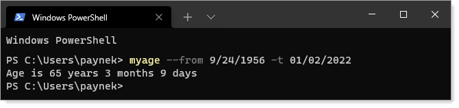

# About

 &nbsp;&nbsp;
Simple gobal tool example which calculates the age of person by providing `--from` birthday `--to` date to calculate

Uses NuGet CommandLineParser [package](https://www.nuget.org/packages/CommandLineParser/2.8.0)

Install globally `dotnet tool install -g myage` and `dotnet tool uninstall myage -g` to uninstall



## NuGet package


### Installation

```powershell
dotnet tool install --global myage --version 1.1.2
```

### Updates

```powershell
dotnet tool update -g myage --no-cache
```

### Uninstall

```powershell
dotnet tool uninstall -g myAge
```
