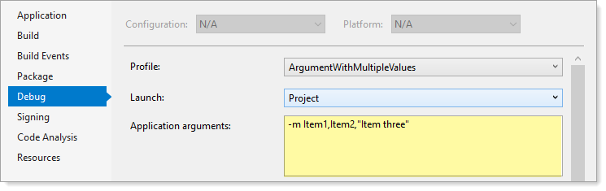

# About

This code sample shows how to pass and argument with multiple values separated by a comma.

Passed arguments

```
-m Item1,Item2,"Item three"
```

- `-m` or `--modules` can be used.
- To include text with a space and in argument 3, use qoutes.




# Requires

:heavy_check_mark: NuGet package [CommandLineParser](https://www.nuget.org/packages/CommandLineParser).