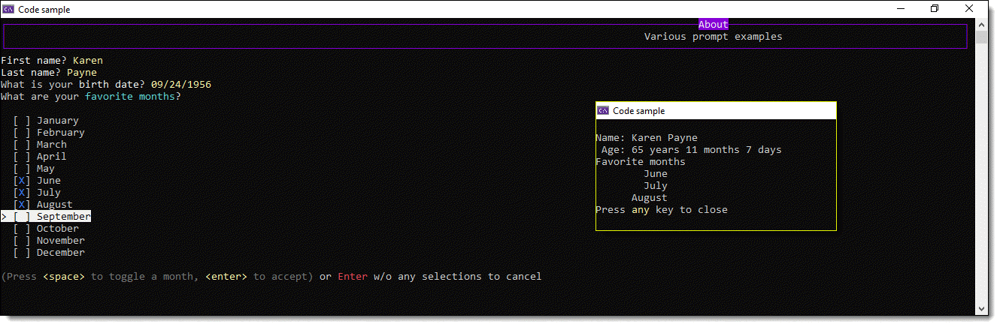

# About



This code sample demonstrates how to create, in this case an instance of a person class.

`Spectre.Console` library makes what follows easy in regards to 

- Asking for user input with and without validation
- Get input as a type e.g. DateTime, int, string rather than in conventional apps accepting a string, validate and convert
- Easily colorize items on the screen.

```csharp
public class Person
{
    public string FirstName { get; set; }
    public string LastName { get; set; }
    public string FullName => $"{FirstName} {LastName}";
    public DateTime? BirthDate { get; set; }
    public List<string> FavoriteMonths { get; set; }
    public string Age() => BirthDate == MinValue ? "" : BirthDate?.Age(Now).YearsMonthsDays;
}
```

First ask for a first name using a prompt which has validation.

```csharp
public static string GetFirstName() =>
    AnsiConsole.Prompt(
        new TextPrompt<string>("[white]First name[/]?")
            .PromptStyle("yellow")
            .AllowEmpty()
            .Validate(value => value.Trim().Length switch
            {
                < 3 => ValidateFirstName(),
                _ => ValidationResult.Success(),
            })
            .ValidationErrorMessage("[red]Please enter your first name[/]"));
```

First ask for a first name using a prompt which has validation. Here we allow an empty string which goes to a validator ValidateFirstName and the same if the input length is less than three characters. If the user decides to continue an error message appears indicating validation failed and again prompts for first name.


`Spectre.Console` library has a confirm method to ask a question which can only be used when no other prompts from this library are active so to resolve this, in this case I stole a pre-done question method.

We than ask for a last name, unlike first name the prompt requires validation rules to be satisfied but for a real app we should follow the same as with first name.

Next a date is asked for as with first name, an empty entry is allowed. Note the validation rule, the date year must be greater or equal to 2001.

```csharp
public static DateTime? GetBirthDate() =>
    AnsiConsole.Prompt(
        new TextPrompt<DateTime>("What is your [white]birth date[/]?")
            .PromptStyle("yellow")
            .ValidationErrorMessage("[red]Please enter a valid date or press ENTER to not enter a date[/]")
            .Validate(dateTime => dateTime.Year switch
            {
                    >= 2001 => ValidationResult.Error("[red]Must be less than 2001[/]"),
                _ => ValidationResult.Success(),
            })
            .AllowEmpty());
```

Next, present a menu of months, ask for a single or multiple selection

```csharp
public static List<string> GetFavoriteMonths() => AnsiConsole.Prompt
(
    new MultiSelectionPrompt<string>()
        .PageSize(12)
        .Required(false)
        .Title("What are your [cyan]favorite months[/]?")
        .InstructionsText("[grey](Press [yellow]<space>[/] to toggle a month, [yellow]<enter>[/] to accept)[/] or [red]Enter[/] w/o any selections to cancel")
        .AddChoices(CurrentInfo!.MonthNames[..^1])
        .HighlightStyle(new Style(Color.White, Color.Black, Decoration.Invert))
);
```


Once all inputs have been entered, display these values.

# Requireents

- Microsoft Visual Studio 2019 or higher
- The .NET Core Framework 5 or higher

# Summary

If you are a new developer looking for an easy way to accept input there are two things to consider, you can copy-n-paste code into your application and use the code but a better way is to first study the code, understand how things work before performing a copy-n-paste as this will make life easier if a problem arises.


For intermediate to advance developers, I would suggest copying code in the Prompts class into a class project and build on code presented for use in one or more console apps.

# Social

[](https://stackoverflow.com/users/5509738/karen-payne) [](http://www.twitter.com/KarenPayneMVP) 