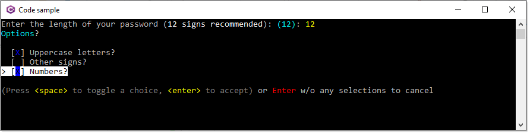

# About

- First prompt, ask for a number between 1-12
- Second prompt, multiple choices or none.



## Model

```csharp
public class UserChoices
{
    public int PasswordLength { get; set; }
    public bool UseUppercaseLetters { get; set; }
    public bool UseOtherSigns { get; set; }
    public bool UseNumbers { get; set; }
}
```