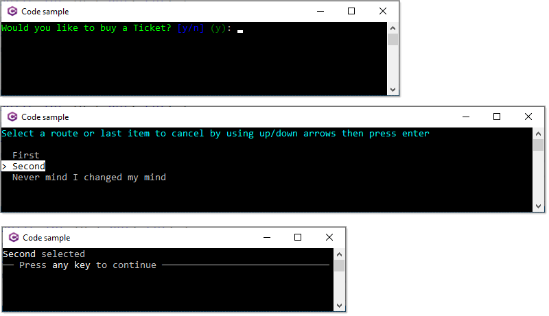

# About

Based off this question on Stackoverflow: [C# Conditions statement](https://stackoverflow.com/questions/72888590/c-sharp-conditions-statement)

An example that

Ask a question, if response is `y` move to a list to select an option else if response was `n` exit.

Note that AnsiConsole.Confirm will not take `Y` or `N` but we can create our own as shown in project AskConsoleCalcApp, in the class Prompts.

