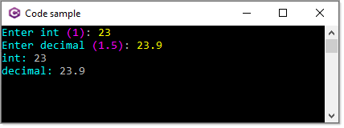

# About

Shows how to ask for numeric values with default values



```csharp
public class Prompts
{
    // Default value style
    private static readonly Style _style = 
        new(Color.Fuchsia, Color.Black, Decoration.None);

    /// <summary>
    /// Get an int
    /// </summary>
    public static int GetInt() =>
        AnsiConsole.Prompt(
            new TextPrompt<int>("[cyan]Enter int[/]")
                .PromptStyle("yellow")
                .DefaultValue(1)
                .DefaultValueStyle(_style));

    /// <summary>
    /// Get an decimal
    /// </summary>
    public static decimal GetDecimal() =>
        AnsiConsole.Prompt(
            new TextPrompt<decimal>("[cyan]Enter decimal[/]")
                .PromptStyle("yellow")
                .DefaultValue(1.5m)
                .DefaultValueStyle(_style));

}
```

---

```csharp
partial class Program
{
    static void Main(string[] args)
    {

        int intValue = Prompts.GetInt();
        decimal decimalValue = Prompts.GetDecimal();

        AnsiConsole.MarkupLine($"[cyan]int:[/] {intValue}");
        AnsiConsole.MarkupLine($"[cyan]decimal:[/] {decimalValue}");
        Console.ReadLine();
    }
```