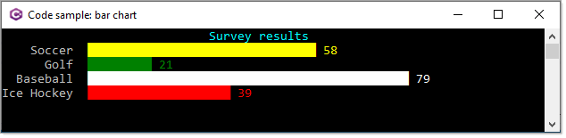

# About

Simple example for a dynamic barchart



```csharp
using System;
using BarChartConsoleApp.Classes;
using Spectre.Console;

namespace BarChartConsoleApp
{
    partial class Program
    {
        static void Main(string[] args)
        {
            var chart = new BarChart { Width = 60 };

            chart.Label("[cyan bold]Survey results[/]");

            foreach (var sportItem in SportsSurvey.List)
            {
                chart.AddItem(sportItem.Name, sportItem.Count, sportItem.Color);
            }

            AnsiConsole.Write(chart);

            Console.ReadLine();
        }
    }
}

```