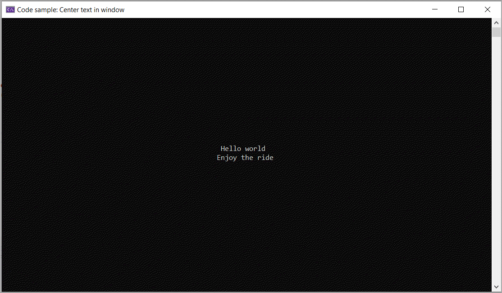

# About

Shows how to write text to the center of a window.

See the same code in the class project `ConsoleHelperLibrary`

```csharp
internal partial class Program
{
    static void Main(string[] args)
    {
        CenterLines("Hello world","Enjoy the ride");
        Console.ReadLine();
    }

    public static void CenterLines(params string[] lines)
    {

        int verticalStart = (Console.WindowHeight - lines.Length) / 2;
        int verticalPosition = verticalStart;

        foreach (var line in lines)
        {
            int horizontalStart = (Console.WindowWidth - line.Length) / 2;
            Console.SetCursorPosition(horizontalStart, verticalPosition);
            Console.Write(line);
            ++verticalPosition;
        }
    }
}
```

