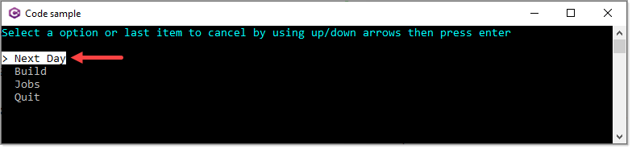
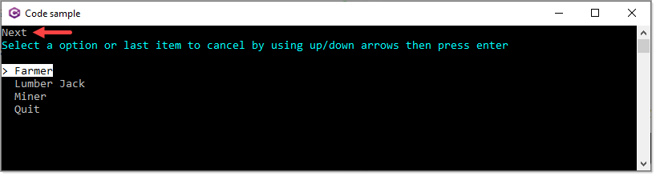

# About

Based off a forum [question](https://csharpforums.net/threads/looking-over-code.8241/)

They are using conventional Console.ReadLine to obtain user input with repetitive code which is fine but there are better options for selecting from multiple choices as with `AnsiConsole.Prompt` together with new `SelectionPrompt<T>()`.

Where this code sample differs from the other code samples for menues is enum are used.

For example, the main menu options use the following enum as a property in the class below.

```csharp
public enum MainMenu
{
    NextDay,
    Build,
    Jobs,
    Quit
}
```

Class used to display the main menu

```csharp
public class MainMenuOptions
{
    public MainMenu Id { get; set; }
    public Action Action;
    public override string ToString() => Id.ToString().SplitCamelCase();
}
```

Here is the main menu prompt

```csharp
public static MainMenuOptions MainMenu =>
    AnsiConsole.Prompt(
        new SelectionPrompt<MainMenuOptions>()
            .Title("[cyan]Select a option or last item to cancel by using up/down arrows then press enter[/]")
            .AddChoices(MainChoices())
            .HighlightStyle(
                new Style(
                    Color.White,
                    Color.Black,
                    Decoration.Invert)));
```

As presented, note the option `NextDay` is presented as `Next Day` as per the string override above using a string extension to split text on upper cased characters



In this case `Next Day` is selected which we invoke the associated `Action` without clearing the screen.



**Point to make**

All code is neatly organized outside the Main method and easier to maintain rather than place all code in the Main method.

```csharp
using System;
using ColonySimulatorApp.Classes;
using ColonySimulatorApp.Models;
using Spectre.Console;

namespace ColonySimulatorApp
{
    partial class Program
    {
        static void Main(string[] args)
        {
            
            while (true)
            {
                AnsiConsole.Clear();
                MainMenuOptions mainChoice = MenuChoices.MainMenu;
                if (mainChoice.Id == MainMenu.Quit)
                {
                    return;
                }
                else
                {
                    mainChoice.Action();
                    var jobType = MenuChoices.JobTypeMenu;
                    Console.WriteLine(jobType);
                    Console.ReadLine();
                }
            }


        }
    }
}
```

# In closing

The code presented is not complete to what to the question posted, it's meant to be a possible path to follow/
