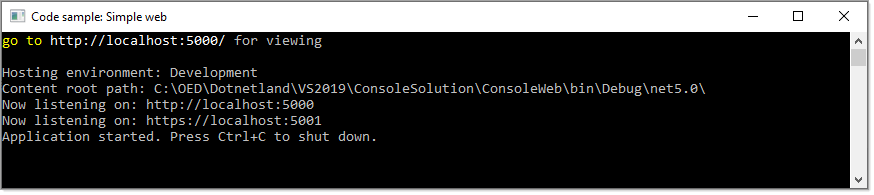

# Your first .NET Core web application using just the command line (in ten minutes or less)

Taken from [here](https://jonhilton.net/2016/07/18/your-first-net-core-web-application-using-nothing-but-the-command-line/) and slightly modified by Karen.

1. Run
2. Go to [http://localhost:5000](http://localhost:5000)

