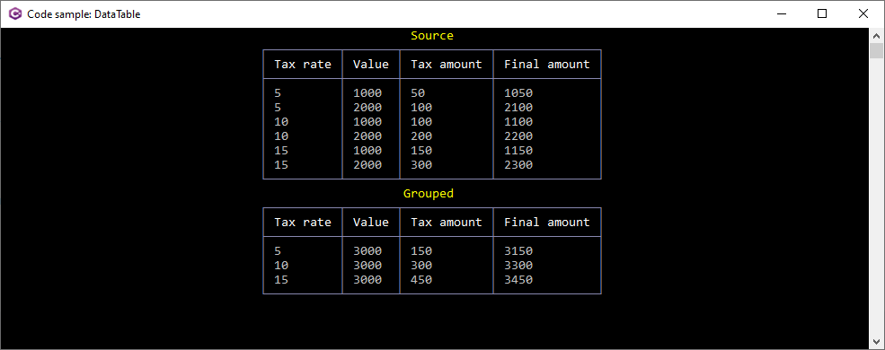

# About

Performing grouping with a DataTable.

```csharp
public static DataTable GroupData(DataTable dt)
{

    return dt.AsEnumerable()
        .GroupBy(row => row.Field<decimal>("TaxRate"))
        .Select(grouped =>
        {
            var row = dt.NewRow();

            row["TaxRate"] = grouped.Key;
            row["Value"] = grouped.Sum(dRow => dRow.Field<decimal>("Value"));
            row["TaxAmount"] = grouped.Sum(dRow => dRow.Field<decimal>("TaxAmount"));
            row["FinalValue"] = grouped.Sum(dRow => dRow.Field<decimal>("FinalValue"));

            return row;

        })
        .CopyToDataTable();
}
```

