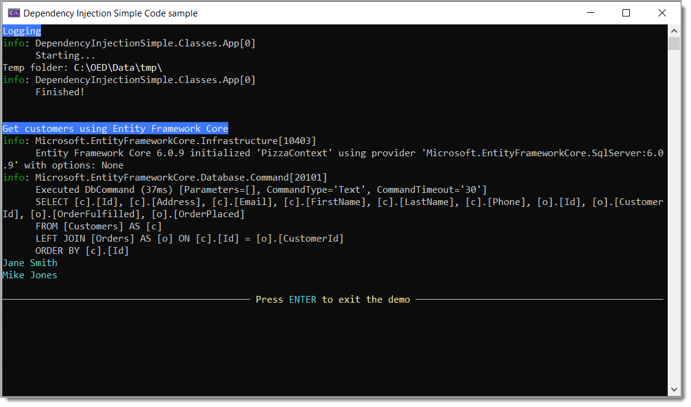
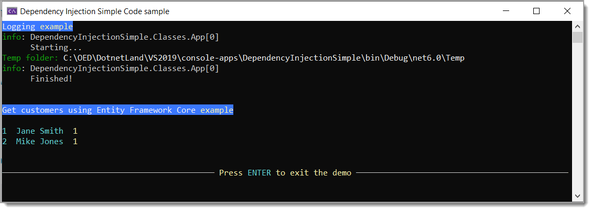

# How to implement dependency injection in a console project

Simple example for `dependency injection` for EF Core and simple logging in a console project. 

> **Note**
>The Dependency Injection Design Pattern in C# allows us to develop loosely coupled software components. In other words, we can say that Dependency Injection Design Pattern is used to reduce the tight coupling between the software components. As a result, we can easily manage future changes and other complexity in our application.

Code presented uses Microsoft Visual Studio 2022, .NET Core 7.

# Why in a console project?

If for no other reason, consider this for learning which can be taken forward into ASP.NET Core. Otherwise there is really no reason to use DI for smaller projects but that is up to each developer.

# Setup for dependency injection

This is done in `Utilities` class under the `Classes` folder.

The method `ConfigurationRoot()` provides access to settings in appsettings.json for reading `Logging` and `App` sections in the method `ConfigureServices()`.

## Service configuration

This is done in `Utilities.ConfigureServices()`. First logging is configured in the local method `ConfigureService` followed by registering  <kbd>App</kbd> and  <kbd>DataAccess</kbd> servicecs along with setting up a DbContext [PizzaContext](https://github.com/karenpayneoregon/console-apps/blob/master/DependencyInjectionSimple/Data/PizzaContext.cs)


# Main method

This is where everything comes together. What is important to consider is many code samples doing DI tend to write all the required setup in one class while in this code sample all the setup has been split out into separate classes and makes it easier to repeat in other projects.

```csharp
partial class Program
{
    public static async Task Main(string[] args)
    {
        var services = Utilities.ConfigureServices();

        await using var serviceProvider = services.BuildServiceProvider();
        await serviceProvider.GetService<App>()!.Run(args);
        await serviceProvider.GetService<DataAccess>()!.Execute(args);
    }
}
```


# Data script

For the data access sample, run script.sql under the scripts folder first.

# NuGet packages

:beginner: Recommend not copy and pasting from the project file as time goes by there most likely will be newer versions of each package

- `Microsoft.EntityFrameworkCore.SqlServer` for EF Core
- Microsoft.Extensions.Configuration
    - `Microsoft.Extensions.Configuration.EnvironmentVariables`
    - `Microsoft.Extensions.Configuration.FileExtensions`
    - `Microsoft.Extensions.Configuration.Json`
- `Microsoft.Extensions.DependencyInjection`
    - `Microsoft.Extensions.DependencyInjection.Abstractions`
- `Microsoft.Extensions.Logging`
    - `Microsoft.Extensions.Logging.Console`
    - `Microsoft.Extensions.Logging.Debug`
    - `Microsoft.Extensions.Options`
- `ConfigurationLibrary` for reading connection strings from `appsettings.json`
- `ConsoleHelperLibrary` provides methods to position console windows
- `Spectre.Console`  library that makes it easier to create beautiful console applications. (there are many code samples in this repository)

**Screen shot with logging**



**Screen shot without EF Core logging**



## appsettings.json

Stored information for both classes

1.  <kbd>App</kbd> is for `App.cs` which reads `TempDirectory` and appends to Path.Combine. Note `Temp` is created under bin folder via a MS Build after build command in the project file.
1. ConnectionsConfiguration is read in via my NuGet package [ConfigurationLibrary](https://www.nuget.org/packages/ConfigurationLibrary/).
1. `Logging.Microsoft.EntityFrameworkCore` turns off logging for EF Core for work done in <kbd>DataAccess</kbd>

```json
{
  "App": {
    "TempDirectory": "Temp"
  },

  "ConnectionStrings": {
    "PizzaConnection": "Server=(localdb)\\MSSQLLocalDB;Database=OED.Pizza;Trusted_Connection=True"
  },

  "Logging": {
    "LogLevel": {
      "Default": "Information",
      "Microsoft": "Information",
      "Microsoft.Hosting.Lifetime": "Information",
      "Microsoft.EntityFrameworkCore": "None"
    }
  }
}
```

# After build command

Used to ensure the path exists under the executable folder for <kbd>App.Run()</kbd> class.

```xml
<Target Name="MakeTempFolder" AfterTargets="Build">
	<MakeDir Directories="$(OutDir)Temp" />
</Target>
```

# Summary

Code provided is meant to show the basics past logging for depenency inject were most other code samples give and extend to showing how to work with Entity Framework Core.