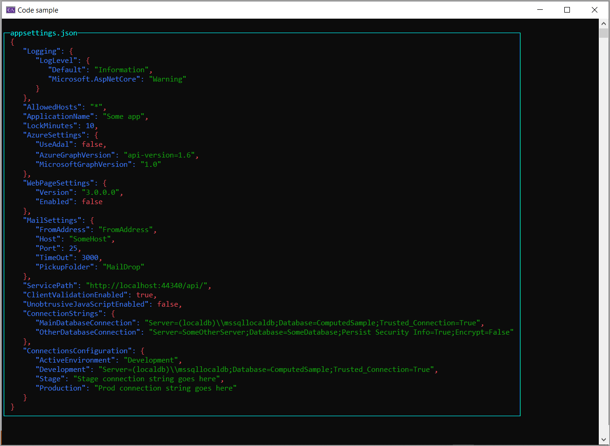

# About

Provides an example for displaying `json` in a console window using Spectre.Console library and Spectre.Console.Json libraries, both available from NuGet.


```csharp
using Spectre.Console.Json;

namespace DisplayJsonApp;

internal partial class Program
{
    static void Main(string[] args)
    {
        string fileName = Path.Combine(AppDomain.CurrentDomain.BaseDirectory, "appsettings.json");
        var json = new JsonText(
            File.ReadAllText(fileName)).BracesColor(Color.Red)
            .BracketColor(Color.Green)
            .ColonColor(Color.Blue)
            .CommaColor(Color.Red)
            .StringColor(Color.Green)
            .NumberColor(Color.Blue)
            .BooleanColor(Color.Red)
            .NullColor(Color.Green);

        AnsiConsole.Write(
            new Panel(json)
                .Header("appsettings.json")
                .Collapse()
                .RoundedBorder()
                .BorderColor(Color.Cyan1));
        Console.ReadLine();
    }
}
```

