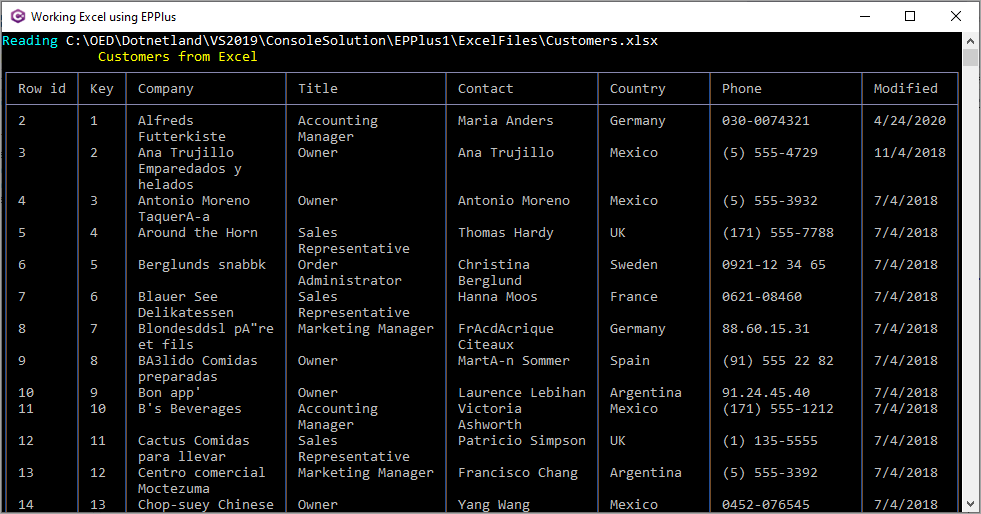

# About

Example which reads a workSheet using [EPPlus](https://www.epplussoftware.com/en) and displaying in a [Spectre.Console Table](https://spectreconsole.net/widgets/table).

Also demonstrates `Spectre.Console`  method to display text with colors and with bold attribute using [Markup class](https://spectreconsole.net/markup).

There is also an extension to `Spectre.Console` for DataTable as shown in `DataTableGroupApp` although I found it to require more work than desired but should not stop others from checking this library out.


```csharp
AnsiConsole.MarkupInterpolated($"[black on white]Last[/] [cyan]Row:[/][b]{lastRow}[/] [cyan]last Col:[/][b]{lastColumn}[/]");
```

