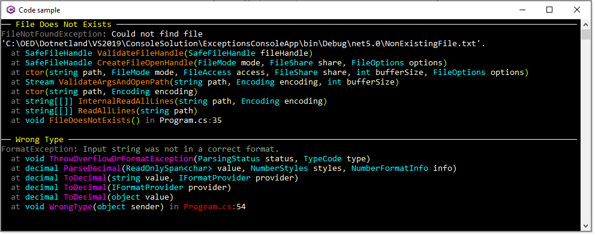

# Spectre.Console Exceptions

Demonstration to view runtime exception using colors which are done to allow easier reading.

```csharp
using System;
using Spectre.Console;

namespace ExceptionsConsoleApp.Classes
{
    public class ExceptionHelpers
    {
        public static void ColorWithCyanFuchsia(Exception exception)
        {
            AnsiConsole.WriteException(exception, new ExceptionSettings
            {
                Format = ExceptionFormats.ShortenEverything | ExceptionFormats.ShowLinks,
                Style = new ExceptionStyle
                {
                    Exception = new Style().Foreground(Color.Grey),
                    Message = new Style().Foreground(Color.DarkSeaGreen),
                    NonEmphasized = new Style().Foreground(Color.Cornsilk1),
                    Parenthesis = new Style().Foreground(Color.Cornsilk1),
                    Method = new Style().Foreground(Color.Fuchsia),
                    ParameterName = new Style().Foreground(Color.Cornsilk1),
                    ParameterType = new Style().Foreground(Color.Aqua),
                    Path = new Style().Foreground(Color.Red),
                    LineNumber = new Style().Foreground(Color.Cornsilk1),
                }
            });
        }

        public static void ColorStandard(Exception exception)
        {
            AnsiConsole.WriteException(exception, new ExceptionSettings
            {
                Format = ExceptionFormats.ShortenEverything | ExceptionFormats.ShowLinks,
                Style = new ExceptionStyle
                {
                    Exception = new Style().Foreground(Color.Grey),
                    Message = new Style().Foreground(Color.White),
                    NonEmphasized = new Style().Foreground(Color.Cornsilk1),
                    Parenthesis = new Style().Foreground(Color.GreenYellow),
                    Method = new Style().Foreground(Color.DarkOrange),
                    ParameterName = new Style().Foreground(Color.Cornsilk1),
                    ParameterType = new Style().Foreground(Color.Aqua),
                    Path = new Style().Foreground(Color.White),
                    LineNumber = new Style().Foreground(Color.Cornsilk1),
                }
            });
        }
    }
}

```


