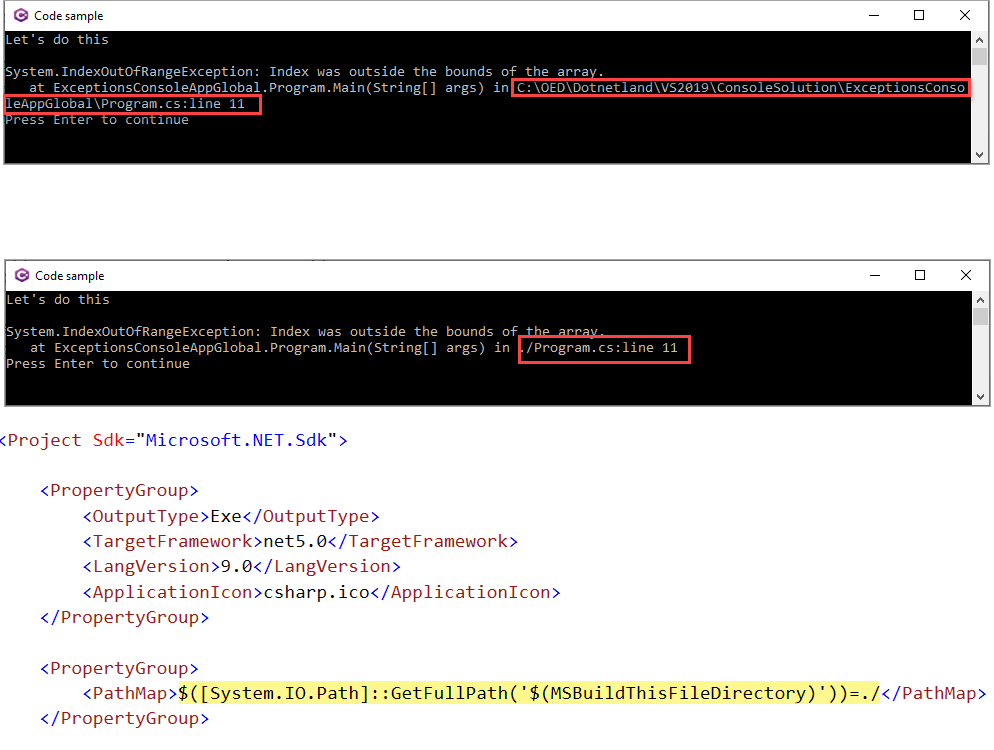

# About

Shows how to provide a globe unhandled exception handler along with cleaning up the stack trace by removing paths to source code as shown in the image below.

Base code is in Classes\Program.cs

For a real application consider writing the exception to a file and show a user friendly message rather than all details which most users careless about and most will not understand.

Double click the project name in Solution Explorer to add

```xml
<PropertyGroup>
   <PathMap>$([System.IO.Path]::GetFullPath('$(MSBuildThisFileDirectory)'))=./</PathMap>
</PropertyGroup>
```


