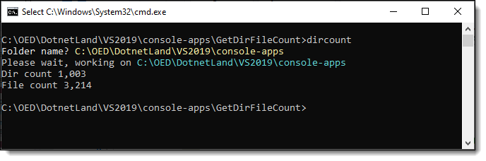
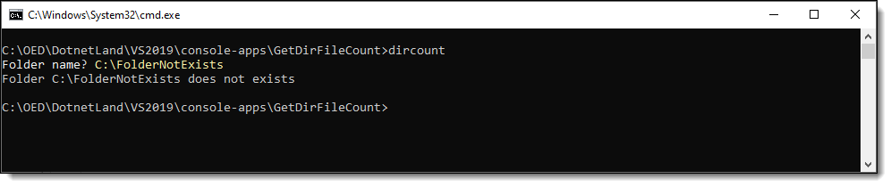

# About

Example to get from a valid folder path, count of folders and count of all files recursively.

From the command prompt type `dircount`, enter a folder name, press <kbd>enter</kbd>.



Now try with a non-existing folder




:small_orange_diamond:
Here there is a prompt for the folder name rather than command arguments for command arguments see `Greetings` project.

```csharp
[Option("-f|--folder")]
```

</br>
Directory code comes from this [repository](https://github.com/karenpayneoregon/iterate-files-directories).


# Install/uninstall

1. Build the project
1. Open a command prompt to the root of this project
1. Enter `dotnet tool install --global --add-source ./nupkg GetDirFileCount` to install the tool
1. Enter `dotnet tool uninstall -g getdirfilecount` to uninstall the tool.

