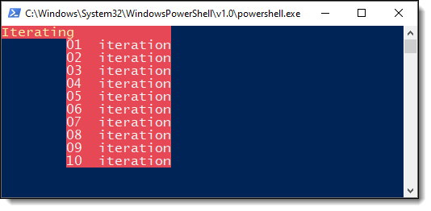

# About

Simple/basic example to work from for creating a dotnet tool

- Example using [CommandLineUtils](https://github.com/natemcmaster/CommandLineUtils)
- Documentation [](https://natemcmaster.github.io/CommandLineUtils/)

Here the argument is `[Option("-t|--times")]` with a range of 0 to 10

```csharp
using McMaster.Extensions.CommandLineUtils;

namespace Greetings;

class Program
{
    public static int Main(string[] args)
    {
        return CommandLineApplication.Execute<Program>(args);
    }

    [Option("-t|--times")]
    [Range(0, 10)]
    [Required]
    public int Count { get; }

    public void OnExecute()
    {
        AnsiConsole.Clear();
        AnsiConsole.MarkupLine($"[yellow on red]Iterating[/][red on red]{new string('.',12)}[/]");
        for (var index = 0; index < Count; index++)
        {
            AnsiConsole.MarkupLine($"\t[white on red]{(index +1), -3:D2} iteration[/]");

        }

        Console.WriteLine();
    }
}
```

Example output via PowerShell


