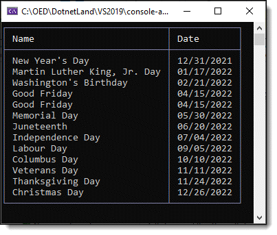

# About

An example to get holidays from [Nager.Date](https://www.nuget.org/packages/Nager.Date/1.35.0?_src=template) library.




**Base code**

```csharp
internal class Operations
{
    public static async Task Run(string countryCode = "US")
    {
        var jsonSerializerOptions = new JsonSerializerOptions { PropertyNameCaseInsensitive = true };

        using var httpClient = new HttpClient();
        
        var response = await httpClient.GetAsync(
            $"https://date.nager.at/api/v3/publicholidays/{DateTime.Now.Year}/{countryCode}");

        if (response.IsSuccessStatusCode)
        {
            await using var jsonStream = await response.Content.ReadAsStreamAsync();
            var publicHolidays = JsonSerializer.Deserialize<PublicHoliday[]>(jsonStream, jsonSerializerOptions);
            
            AnsiConsole.MarkupLine($"[yellow]Holidays[/]");

            var table = new Table()
                .RoundedBorder()
                .AddColumn("[b]Name[/]")
                .AddColumn("[b]Date[/]")
                .Alignment(Justify.Left)
                .BorderColor(Color.LightSlateGrey);

            foreach (var holiday in publicHolidays!)
            {

                if (holiday.Date.Month == DateTime.Now.Month)
                {
                    table.AddRow($"[cyan]{holiday.Name}[/b]", $"[cyan]{holiday.Date:MM/dd/yyyy}[/]");
                }
                else
                {
                    table.AddRow(holiday.Name, holiday.Date.ToString("MM/dd/yyyy"));
                }
            }

            AnsiConsole.Clear();
            AnsiConsole.Write(table);
        }

    }
}
```

# Note

The majority of functionality in the library requires you to be a sponsor.