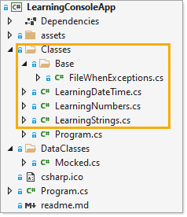

# About

**Work in progress**

- Anything which has to do with console window like centering on the display screen place the base code in a class project so other console projects can use this code.
- Separate what you are learning into classes

  
- Use colors to easily identify what you are doing

  

- If what you are learning would require scrolling than make the window full screen as in this project

Use Program.Main to execute code as shown below there are several methods, one un-commented as this one is for current learning

```csharp
using System;
using LearningConsoleApp.Classes;

namespace LearningConsoleApp
{
    partial class Program
    {
        static void Main(string[] args)
        {

            //LearningStrings.IterateArray();
            //LearningStrings.ArrayContains();
            //LearningDateTime.StringToDateTime();
            //LearningDateTime.TimeDesignator();
            //LearningDateTime.TimeOfDayCode();
            LearningNumbers.GetDecimalFraction();

            Console.ReadLine();
        }
    }
}
```

## Tips

- All methods in helper classes or class with language extensions can be written in the code which will use it then when satisfied move it to it's own file.
- For the above I highly recommend for next step is to write unit test.