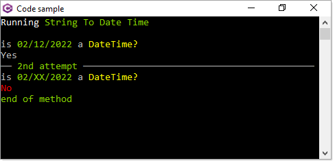

# About

**Work in progress**

- Anything which has to do with console window like centering on the display screen place the base code in a class project so other console projects can use this code.
- Separate what you are learning into classes
- Use colors to easily identify what you are doing

  

- If what you are learning would require scrolling than make the window full screen as in this project