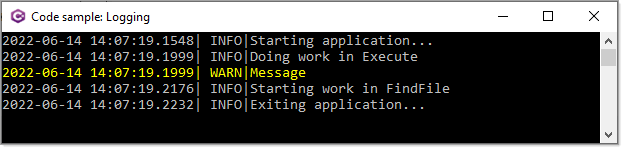

# Simple logging

Logging can be very important for either learning or troubleshooting issues in a console application.

In this project [nlog](https://nlog-project.org/) is used controlled in nlog.config. There are two outputs, one to a file in the application folder (target1) or to the console screen (target2).

```xml
<!-- the targets to write to -->
<targets>
	<!-- write logs to file -->
	<target xsi:type="File" name="target1" fileName="${basedir}/LogFile.txt"
		    layout="${date}|${level:uppercase=true}|${message} ${exception}|${logger}|${all-event-properties}" />
	<!-- write to console-->
	<target xsi:type="Console" name="target2"
		    layout="${date}|${level:uppercase=true}|${message} ${exception}|${logger}|${all-event-properties}" />
</targets>

<!-- rules to map from logger name to target -->
<rules>
	<logger name="*" minlevel="Trace" writeTo="target1" />
</rules>
```

**Possible outputs**

- File
- Event log
- Console
- Database
- Debugger output
- E-Mail

**Configurations**

Make sure to read the nlog documentaton on various configurations along with rather than using xml file to configure `appsettings.json` is supported.

**In code**

```csharp
var config = new LoggingConfiguration();
var consoleTarget = new ConsoleTarget
{
    Name = "console",
    Layout = "${longdate}|${level:uppercase=true}|${logger}|${message}",
};

config.AddRule(NLog.LogLevel.Debug, NLog.LogLevel.Debug, consoleTarget);
LogManager.Configuration = config;
```

## Colored output

This can be done in the configuration file or in code.

See [the following page](https://github.com/NLog/NLog/wiki/ColoredConsole-target) for how to.




