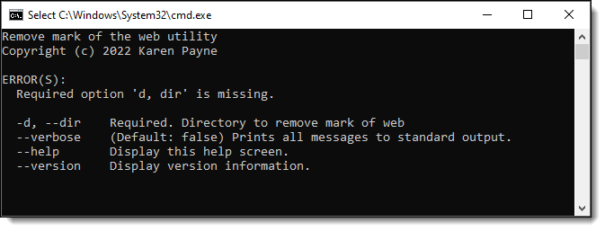
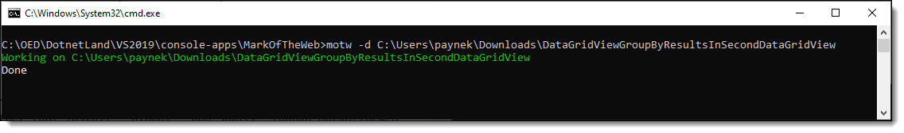

# About

A utility to remove `mark of the web` from a folder recursively to all sub-folders.

If after downloading and un-zipping a archive file with perhaps a Visual Studio solution the files extracted may have been blocked, with this utility close Visual Studio, run this utility on the folder than re-open Visual Studio.

Current arguments (change to suite your environment)

**Base code**

```csharp
public static void UnblockFiles(string folderName)
{
    if (!Directory.Exists(folderName))
    {
        return ;
    }

    var start = new ProcessStartInfo
    {
        FileName = "powershell.exe",
        RedirectStandardOutput = true,
        Arguments = $"Get-ChildItem -Path '{folderName}' -Recurse | Unblock-File",
        CreateNoWindow = true, 
        UseShellExecute = false
    };

    using var process = Process.Start(start);
    process.WaitForExit();
}
```


##  Tool

### Install/uninstall

```
dotnet tool install --global --add-source ./nupkg MarkOfTheWeb
dotnet tool uninstall -g MarkOfTheWeb
```

#### Run without arguments




#### Run with arguments

Here a .zip file was downloaded and files extracted which at that point several files had mark of the web.

