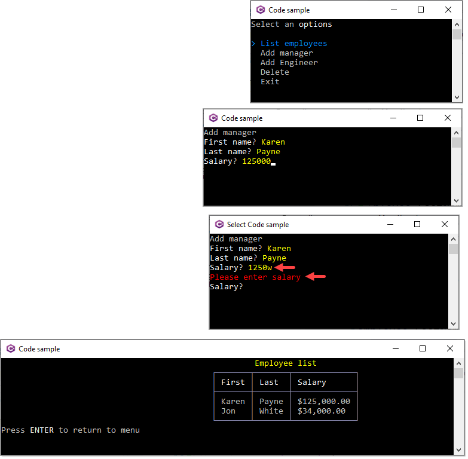

# About

Basic example using [Spectre.Console](https://spectreconsole.net/) NuGet package which provide a starting point for the following [forum question](https://stackoverflow.com/questions/72847255/adding-items-to-list-from-user-input-and-printing-list-out-to-console/72850857#72850857).

