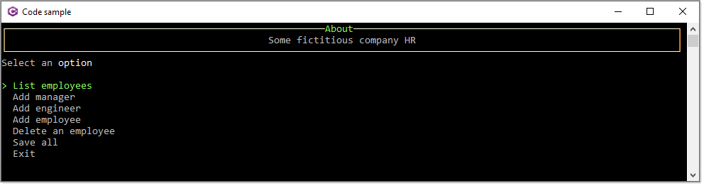

# About

Basic example using [Spectre.Console](https://spectreconsole.net/) NuGet package which provide a starting point for the following [forum question](https://stackoverflow.com/questions/72847255/adding-items-to-list-from-user-input-and-printing-list-out-to-console/72850857#72850857). Since this is something others would be interested in I have add much more to this project so it's not so basic anymore.

To understand this project, take time to fully study the code as there are many aspects a new developer may not understand. Once you have studeied the code, consider placing breakpoints and step through the code to get an even better understanding of the code flow.

Data is stored in a .json file in the application folder.

