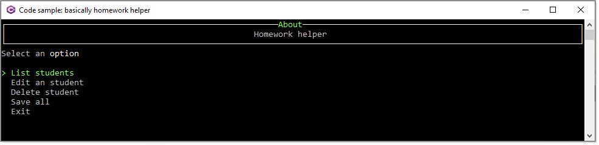

# About



A menu system to edit, view and remove objects. In this case we are dealing with the following model.

```csharp
public class Student
{
    public int Id { get; set; }
    public string FirstName { get; set; }
    public string LastName { get; set; }
    public int Grade { get; set; }
    public override string ToString() => $"{FirstName,-20}{LastName}";

    public Student() { }

    public Student(int identifier)
    {
        Id = identifier;
    }
}
```

Data is generated using [Bogus](https://www.nuget.org/packages/Bogus) NuGet package

```csharp
public class BogusOperations
{
    public static List<Student> Students { get; set; }

    /// <summary>
    /// Generate a list of students
    /// </summary>
    /// <param name="count">how many to generate, five is the default</param>
    /// <returns>List of students with a exit option</returns>
    public static List<Student> GenerateStudents(int count = 5)
    {
        int identifier = 1;

        Faker<Student> prices = new Faker<Student>()
            .CustomInstantiator(f => new Student(identifier++))
            .RuleFor(student => student.FirstName, f => f.Person.FirstName)
            .RuleFor(student => student.LastName, f => f.Person.LastName)
            .RuleFor(student => student.Grade, f => f.Random.Int(1,100));

        List<Student> list = prices.Generate(count);
        list.Add(new Student() {Id = -1, FirstName = "Exit"});
        return list;
    }

    /// <summary>
    /// Used to read bogus students, if not generated, generate and if they
    /// have already been generated return the generated students
    /// </summary>
    /// <returns></returns>
    public static List<Student> GetStudents() => Students ??= GenerateStudents();
}
```

All displaying and edits are done in the `Prompts` class as in other code samples.


```csharp
public class Prompts
{

    public static void DisplayCurrentStudent(Student student)
    {
        AnsiConsole.Clear();
        AnsiConsole.MarkupLine("[cyan]Current student values[/]");
        AnsiConsole.MarkupLine($"[b]Identifier:[/] {student.Id}");
        AnsiConsole.MarkupLine($"[b]First name:[/] {student.FirstName}");
        AnsiConsole.MarkupLine($" [b]Last name:[/] {student.LastName}");
        AnsiConsole.MarkupLine($"     [b]Grade:[/] {student.Grade}");
        Console.ReadLine();
    }

    public static void Edit(Student student)
    {
        student.FirstName = FirstName(student.FirstName);
        student.LastName = LastName(student.LastName);
        student.Grade = Grade(student.Grade);
    }

    public static string FirstName(string sender) =>
        AnsiConsole.Prompt(
            new TextPrompt<string>("[white]First name[/]?")
                .PromptStyle("yellow")
                .DefaultValue(sender)
                .Validate(value => value.Length switch
                {
                    < 3 => ValidationResult.Error("[red]Must have at least three characters[/]"),
                    _ => ValidationResult.Success(),
                })
                .ValidationErrorMessage("[red]Please enter your first name[/]"));


    public static string LastName(string sender) =>
        AnsiConsole.Prompt(
            new TextPrompt<string>("[white]Last name[/]?")
                .PromptStyle("yellow")
                .DefaultValue(sender)
                .ValidationErrorMessage("[red]Please enter your last name[/]"));

    public static int Grade(int sender) =>
        AnsiConsole.Prompt(
            new TextPrompt<int>("[white]Grade[/]?")
                .PromptStyle("yellow")
                .DefaultValue(sender)
                .Validate(grade => grade switch
                {
                    < 1 => ValidationResult.Error("[red]Must be 1 to 100[/]"),
                    > 100 => ValidationResult.Error("[red]Must be 1 to 100[/]"),
                    _ => ValidationResult.Success(),
                })
                .ValidationErrorMessage("[red]Please enter a grade[/]"));
}
```

All sub menu operations are performed in Classes\Program.cs

```csharp
partial class Program
{
    [ModuleInitializer]
    public static void Init()
    {
        Console.Title = "Code sample: basically homework helper";

        W.SetConsoleWindowPosition(W.AnchorWindow.Left | W.AnchorWindow.Top);

    }

    /// <summary>
    /// Operations to perform from selection in main menu
    /// </summary>
    /// <param name="menuItem">option from main menu</param>
    /// <param name="StudentList">current list of students</param>
    private static void Selection(MenuItem menuItem, List<Student> StudentList)
    {
        AnsiConsole.Clear();
        
        Student student;

        switch (menuItem.Id)
        {
            case 0:
                student = AnsiConsole.Prompt(MenuOperations.StudentMenu());
                if (student.Id > 0)
                {
                    Display(student);
                }
                break;
            case 1:
                student = AnsiConsole.Prompt(MenuOperations.StudentMenu());
                if (student.Id > 0)
                {
                    Edit(student);
                }
                break;
            case 2:
                student = AnsiConsole.Prompt(MenuOperations.StudentMenu());
                if (student.Id > 0)
                {
                    Remove(student, StudentList);
                }
                break;
            case 3:
                Save(StudentList);
                break;
        }
    }

    /// <summary>
    /// Display selected student properties
    /// </summary>
    /// <param name="student">student to display properties for</param>
    public static void Display(Student student)
    {
        Prompts.DisplayCurrentStudent(student);
    }

    /// <summary>
    /// Edit a student
    /// </summary>
    /// <param name="student">student to edit</param>
    public static void Edit(Student student)
    {
        Prompts.Edit(student);
    }

    /// <summary>
    /// Remove student from list
    /// </summary>
    /// <param name="student">student to remove</param>
    /// <param name="StudentList">list to remove student from</param>
    public static void Remove(Student student, List<Student> StudentList)
    {
        if (AnsiConsole.Confirm($"Remove {student.FirstName} {student.LastName}?", false))
        {
            StudentList.Remove(student);
        }
    }

    /// <summary>
    /// Place holder if data should be saved. If used the logic to
    /// load students must change as it currently creates mocked data via Bogus library
    /// </summary>
    /// <param name="list"></param>
    public static void Save(List<Student> list)
    {
        // optional, perhaps to a json file
    }
}
```