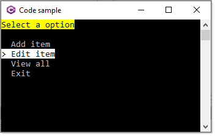

# About

This is a very basic menu example, a good place to start learning how to create a simple menu.



Each menu item is defined by the following model.

```csharp
public class MenuItem
{
    /// <summary>
    /// Identifier
    /// </summary>
    /// <remarks>
    /// Create a menu item with a Id of -1 for exiting
    /// </remarks>
    public int Id { get; set; }
    /// <summary>
    /// Menu text to display
    /// </summary>
    public string Text { get; set; }
    /// <summary>
    /// Place to store something about the menu item
    /// </summary>
    public string Information { get; set; }
    /// <summary>
    /// Action to perform on selection
    /// </summary>
    public Action Action;
    public override string ToString() => Text;
}
```

Code responsible for creating the menu.

```csharp
class MenuOperations
{
    /// <summary>
    /// Create main menu
    /// </summary>
    public static SelectionPrompt<MenuItem> SelectionPrompt()
    {
        SelectionPrompt<MenuItem> menu = new()
        {
            HighlightStyle = new Style(Color.Black, Color.White, Decoration.None)
        };

        menu.Title("[black on yellow]Select a option[/]");
        menu.PageSize = 14;
        menu.AddChoices(new List<MenuItem>()
        {
            new () {Id = 1, Text = "Add item",  Information = "First",  Action = () => AnsiConsole.MarkupLine("[yellow]Add[/]") },
            new () {Id = 2, Text = "Edit item", Information = "Second", Action = () =>  AnsiConsole.MarkupLine("[red]Edit[/]") },
            new () {Id = 3, Text = "View all",  Information = "Third",  Action = () =>  AnsiConsole.MarkupLine("[cyan]View[/]") },
            new () {Id = -1,Text = "Exit"},
        });

        return menu;

    }
}
```