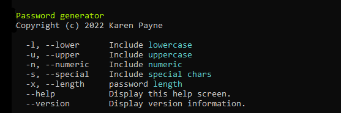

# About

Generate random password. 

The main purpose is not to learn how to create a password generator but instead how to work with multiple arguments being passed to the app.

To spice things up NuGet package [spectre.console](https://spectreconsole.net/) is used in the app's help section.

In regards to command arguments, since **l** was used for `lower-case and` **n** was for `numerics` **x** is used for `length` of password while this is odd --length is a better choice

- Package for command-line work, [Command Line Parser Library](https://www.nuget.org/packages/CommandLineParser/)
- Package used to generate passwords is under `General cli\\Clones` and was added as a local Nuget [feed](https://docs.microsoft.com/en-us/nuget/hosting-packages/local-feeds).

