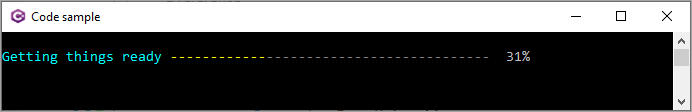

# Spectre Console ProgressBar

Basic example for a progress-bar, see the following [project](https://github.com/spectreconsole/spectre.console/tree/main/examples/Console/Progress) for a larger code sample.



```csharp
namespace ProgressApp
{
    partial class Program
    {
        static async Task Main(string[] args)
        {

            await AnsiConsole.Progress().StartAsync(async ctx =>
            {

                var gettingReadyTask = ctx.AddTask("[cyan]Getting things ready[/]");
                
                while (!ctx.IsFinished)
                {

                    await Task.Delay(300);
                    gettingReadyTask.Increment(10.5);

                }
            });

            Console.ReadLine();
        }
    }
}

```