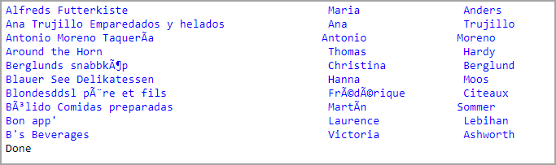

# About

Demonstration for `Spectre.Console` methods to record what has been written to the screen.

Use `AnsiConsole.Record();` to start recording and `AnsiConsole.ExportText()` to get text without formatting.

## Other options

- `ExportHtml` Exports all recorded console output as HTML text.
- `ExportCustom` Exports all recorded console output using a custom encoder.

# Unit testing

Have the ability to record unit test outside of convention methods can be 

# Sample HTML

Note some columns are not exact because spans are used rather than proper divs with classes.

