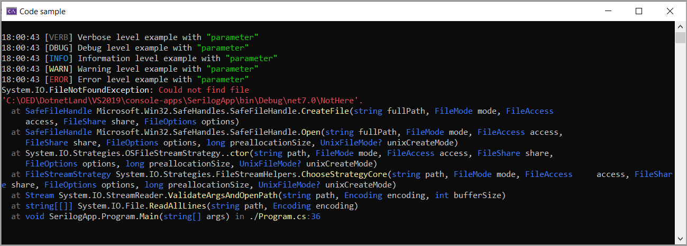

# About

A third party NuGet package for `Serilog` using `Spectre.Console`. Note on when the exception is thrown, the path is not seen as per the following in the project file which is explained in [this repository](https://github.com/karenpayneoregon/hide-exception-paths).

```xml
<PropertyGroup>
   <PathMap>$([System.IO.Path]::GetFullPath('$(MSBuildThisFileDirectory)'))=./</PathMap>
</PropertyGroup>
```

