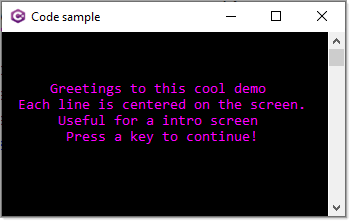
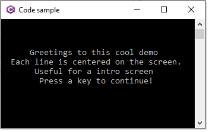

# About

Simple example for changing the window size and center text in a window.

Setting the fore color

```csharp
D.CenterLines(ConsoleColor.Magenta,
    "Greetings to this cool demo", 
    "Each line is centered on the screen.",
    "Useful for a intro screen",
    "Press a key to continue!");
```



</br>

Use the default fore color

```csharp
D.CenterLines("Greetings to this cool demo", 
    "Each line is centered on the screen.",
    "Useful for a intro screen",
    "Press a key to continue!");
```

</br>


