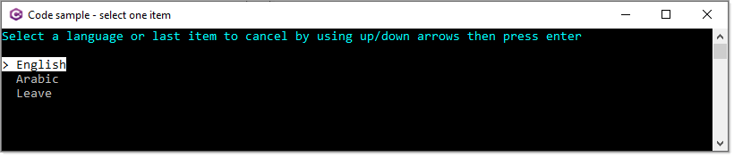

# Acquiring user input

## string, int, decimal, date etc

Acquiring user input in a console application is done use Console.ReadLine method which returns a string. When other types are needed an experienced developer will use assertion as shown below.

```csharp
string joined = Console.ReadLine();
if (DateTime.TryParse(joined, out var joinDateTime))
{
    // we have a date time
}
else
{
    // user entered data which does not represent a date time
}
```

While the novice developer will not coonsidered assertion as per above and go with.

```csharp
var joinDateTime = DateTime.Parse(Console.ReadLine()!);
```

If the input is incorrect, a runtime exception is thrown.

Keeping with `DateTime.TryParse` along with other types e.g. int.TryParse etc, if the wrong input is entered the developer must either abort of use a loop to get the right data input. Either way this ends up being messy.

There is were using `Spectre.Console library` makes life easier using `TextPrompt`.

Simple example to get a date where is input is not a date the internals will prompt again.

```csharp
public static DateTime GetDate() =>
    AnsiConsole.Prompt(new TextPrompt<DateTime>("Enter a [white]date[/]?"));
```

To allow the user to  continue without entering a date.

```csharp
public static DateTime? GetDate() =>
    AnsiConsole.Prompt(
        new TextPrompt<DateTime>("Enter a [white]date[/]?")
            .AllowEmpty());
```

In the above method we are ensured of some date time.

There is also ways to override the default error message when an invalid value is entered.

```csharp
public static DateTime? GetDate() =>
    AnsiConsole.Prompt(
        new TextPrompt<DateTime>("Enter a [white]date[/]?")
            .PromptStyle("yellow")
            .ValidationErrorMessage("[red]Please enter a valid date or press ENTER to not enter a date[/]")
            .AllowEmpty());
```

Even provide validation e.g. in the following method the year for the date entered can not be greater than 2001.

```csharp
public static DateTime? GetDate() =>
    AnsiConsole.Prompt(
        new TextPrompt<DateTime>("Enter a [white]date[/]?")
            .PromptStyle("yellow")
            .ValidationErrorMessage("[red]Please enter a valid date or press ENTER to not enter a date[/]")
            .Validate(dateTime => dateTime.Year switch
            {
                >= 2001 => ValidationResult.Error("[red]Must be less than 2001[/]"),
                _ => ValidationResult.Success(),
            })
            .AllowEmpty());
```

The same is possible with other types, let's look at `int` where input must be between two numbers.

```csharp
public static int GetInt() =>
    AnsiConsole.Prompt(
        new TextPrompt<int>("Enter a [green]number[/] between [b]1[/] and [b]10[/]")
            .PromptStyle("green")
            .ValidationErrorMessage("[red]That's not a valid age[/]")
            .Validate(age => age switch
            {
                <= 0 => ValidationResult.Error("[red]1 is min value[/]"),
                >= 10 => ValidationResult.Error("[red]10 is max value[/]"),
                _ => ValidationResult.Success(),
            }));
```

In all code samples the methods to collect user input using `AnsiConsole.Prompt` and `TextPrompt` are placed in Classes\Prompts.cs

Another nice feature is having the ability to override styles for input as shown below, create a style and use it for the inputs below.

```csharp
public class Prompts
{
    // Default value style
    private static readonly Style _style = 
        new(Color.Fuchsia, Color.Black, Decoration.None);

    /// <summary>
    /// Get an int
    /// </summary>
    public static int GetInt() =>
        AnsiConsole.Prompt(
            new TextPrompt<int>("[cyan]Enter int[/]")
                .PromptStyle("yellow")
                .DefaultValue(1)
                .DefaultValueStyle(_style));

    /// <summary>
    /// Get an decimal
    /// </summary>
    public static decimal GetDecimal() =>
        AnsiConsole.Prompt(
            new TextPrompt<decimal>("[cyan]Enter decimal[/]")
                .PromptStyle("yellow")
                .DefaultValue(1.5m)
                .DefaultValueStyle(_style));

}
```

## Accept a single input from a lisr

Example, we have an app that the user be English or Arabic?



It's fairly simple

```csharp
    public class MenuChoices
    {
        public static List<Language> Languages => new()
        {
            new Language() { Id = 1, Title = "English"},
            new Language() { Id = 2, Title = "Arabic"},
            new Language() { Id = -1, Title = "Leave"}
        };

        public static Language LanguageChoice =>
            AnsiConsole.Prompt(
                new SelectionPrompt<Language>()
                    .Title("[cyan]Select a language or last item to cancel by using up/down arrows then press enter[/]")
                    .AddChoices(MenuChoices.Languages)
                    .HighlightStyle(
                        new Style(
                            Color.White,
                            Color.Black,
                            Decoration.Invert)));
    }
```

Given the model above and method to collect a choice using `SelectionPrompt`

```csharp
partial class Program
{
    static void Main(string[] args)
    {
        Language language = MenuChoices.LanguageChoice;
        if (language.Id == -1)
        {
            return;
        }
        
        AnsiConsole.MarkupLine($"[yellow]{language.Title}[/]");
        AnsiConsole.MarkupLine("[b]Press a key to continue[/]");

        Console.ReadLine();

    }
}
```

Take it up a level (project MenuConsoleApp) to provide an easy to create menu system.


# Summary

Using Spectre.Console makes obtaining user input a snap along with when done properly your code will be cleaner and easier to maintain than using conventional methods to obtain user input.


