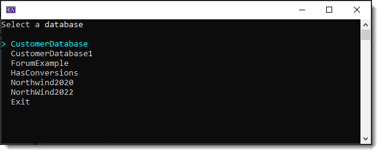
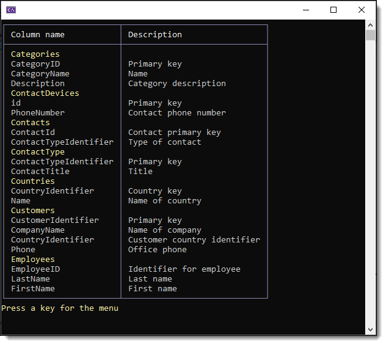
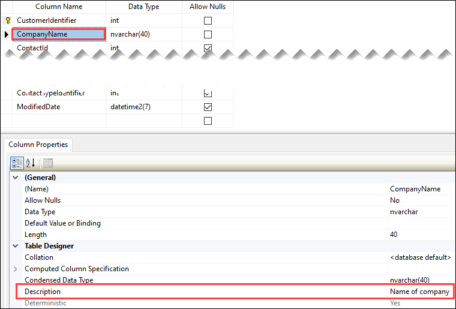
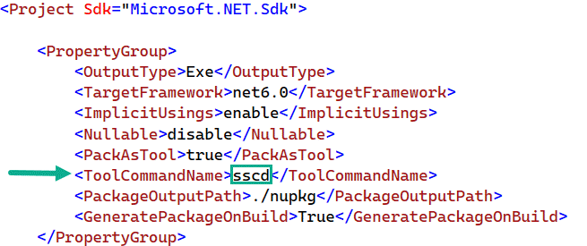
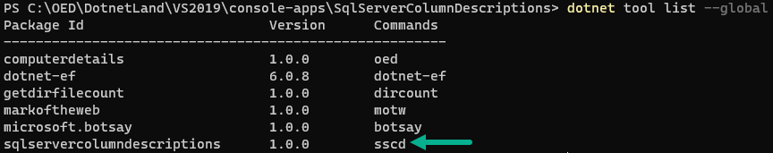

# About

This project shows a menu of all databases under `.\SQLEXPRESS` which when selecting a database if any table has one or more columns with descriptions displays them. If desired, place the server name in a configue file e.g. `appsettings.json`.

This is meant to be a developer tool which is why I didn't use a configuration file as most developers are using one server. If you want to have a dynamic setting for a server there are two choices

- Create an appsetting.json file but remember as a tool you need to traverse to the folder `C:\Users\WindowLoginName\.dotnet\tools`
- Setup a parameter e.g.

```csharp
public sealed class CommandLineOptions
{
    [Option('s', "server", Required = true, HelpText = "sql-server to connect too")]
    public string Server { get; set; }
}
```

:small_orange_diamond: Created with .NET Core 5 but easy enough to upgrade to .NET Core 6 or higher.

## Important

Server used 

```csharp
public static string Server { get; set; } = ".\\SQLEXPRESS";
```

</br>

If the data provider is changed to the following add `Encrypt=False` to the connection string, see [the following repository](https://github.com/karenpayneoregon/hide-exception-paths) for more.

```xml
<PackageReference Include="Microsoft.Data.SqlClient" Version="5.0.0" />
```


## Screenshots



</br>



Description is set in SSMS.



# Use as a tool

To install from the root folder of the project via a PowerShell command prompt

```
dotnet tool install --global --add-source ./nupkg SqlServerColumnDescriptions
```

To uninstall from the root folder of the project via a PowerShell command prompt

```
dotnet tool uninstall -g SqlServerColumnDescriptions
```

## Command

The command is defined in the project file, `sscd`



## Verify via

PowerShell command `dotnet tool list --global`




