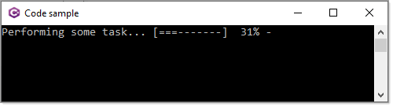

# An ASCII progress bar

https://gist.github.com/DanielSWolf/0ab6a96899cc5377bf54

Console progress bar. Code is under the MIT License: http://opensource.org/licenses/MIT

Karen modified the step character from `#` to `=`

