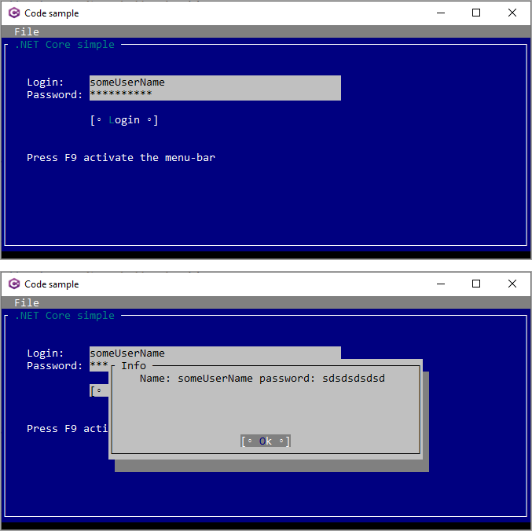

# About

This project highlights [Terminal.Gui](https://github.com/migueldeicaza/gui.cs) - Cross Platform Terminal UI toolkit for .NET

A toolkit for building rich console apps for .NET, .NET Core, and Mono that works on Windows, the Mac, and Linux/Unix.

This library available as a NuGet package provides very nice features and controls. There are several code samples out there that either are too complex or to simple especially for collecting information from controls. So I created this example which should make learning enough about the library if it is right for you.

### Important

I would highly suggest not jumping in head first meaning without understanding this library and have a plan else you will be stuck at one point or another so take time learning and experimenting before jumping in.

### What you get

The screenshot is different to the current code in that this shows full screen while current code centers the window. The author code samples are all full screen (at least from what I saw) so I did it differently.

## 2024

- NET5 to NET8
- [Terminal Gui Designer on GitHub](https://github.com/gui-cs/TerminalGuiDesigner) invoke with `terminalguidesigner`
- [Views](https://gui-cs.github.io/Terminal.Gui/docs/views.html)
- My Views -> C:\OED\Views
