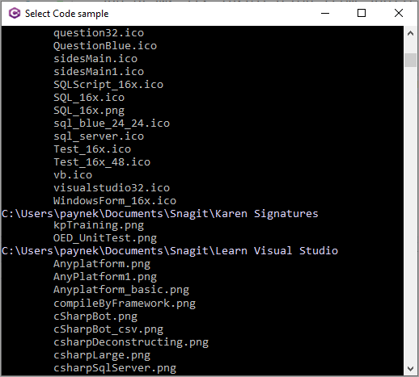

# Spectre.Console.Cli example

From [documentation](https://spectreconsole.net/cli/getting-started) Spectre.Console.Cli is a modern library for parsing command line arguments. While it's extremely opinionated in what it does, it tries to follow established industry conventions, and draws its inspiration from applications you use everyday.

This project written as a convention console application which uses Spectre.Console.Cli to get command line parameter (a folder name) to traverse the entire folder structure.

Most of the code samples for are a) do nothing b) extremely complex or incomplete. This is the reason for this code sample, get assist in learning by first reading Spectre.Console.Cli documentation followed by learning from this simple example.





## Run

:small_orange_diamond: From Visual Studio

- From project option
- Debug tab
- Add the following to `Application arguments`
  - **list** `-d` folder name

:small_orange_diamond: As a tool

traverse-demo **list** `-d` folder name

## To a Tool

In the project file

```xml
   <PackAsTool>true</PackAsTool>
   <ToolCommandName>traverse-demo</ToolCommandName>
   <PackageOutputPath>./nupkg</PackageOutputPath>
```

**Run** `dotnet pack`

**Run** `dotnet tool install --global --add-source ./nupkg traverse-demo`

*Uninstall*

**Run** dotnet tool uninstall -g traverse-demo
