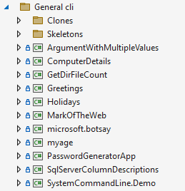

# dotnet tools

A .NET tool is a special NuGet package that contains a console application. You can install a tool on your machine and can be published on NuGet for others to use.

# .NET CLI overview

The [.NET command-line interface](https://docs.microsoft.com/en-us/dotnet/core/tools/) (CLI) is a cross-platform toolchain for developing, building, running, and publishing .NET applications.

# How to manage .NET tools

[Microsoft docs](https://docs.microsoft.com/en-us/dotnet/core/tools/global-tools)

# NuGet tool list

The following [site](https://www.nuget.org/packages?packagetype=dotnettool) list published tools.

# Current examples

# .NET additional tools

List of [tools](https://docs.microsoft.com/en-us/dotnet/core/additional-tools/) that support and extend the .NET functionality, in addition to the .NET CLI.
