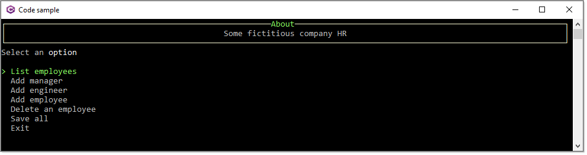
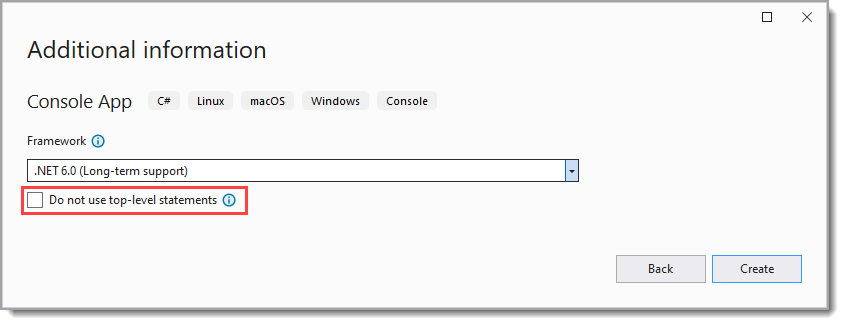

# Learn how to work with Console project user interfaces

*Console applications are back in vogue, hosting everything from input-focused command-line apps, worker services, and ASP.NET Core. As we all use current and future target frameworks, the upgraded console experience is the glow-up story of .NET.*

[Khalid Abuhakmeh](https://twitter.com/buhakmeh)

---



What place do console applications have today? 

First and foremost, provides a place to learn how to program in this case C# language without worrying about learning how to connect basic coding like learning to work with strings, dates with a user interface.

For helper utilities with a simple user interface which can be with user input, or no user interface with parameters sent to the application or read from a configuration file.

Another use as mentioned above, worker services and ASP.NET Core.

Add you can convert a console application into a dotnet tool [](dotnetTools.md)

Other than projects located under the Basics folder use enhanced user interfaces provided by Spectre.Console NuGet package and Terminal.Gui which provides mouse support.

Both `Spectre.Console` and `Terminal.Gui` provide examples for using their libraries although in many cases they are not simple examples which is where these code samples are helpful, broken down, easy to run.

- In several projects `EF Core` is used and for those projects require a script to run to create SQL-Server databases along with populating tables first.
- Other than one project, Program class is setup as partial with startup code under the Classes folder for each project.
- Most projects are centered on screen or full screen using code in ConsoleHelperLibrary

Hope for those just starting out with coding using Console projects find these code samples helpful.

:heavy_check_mark: MenuConsoleAppBasic project is a great place to see a menu system with json data.


In the following screen the autor of the library does not show events, mine does.


## Learn process

- To learn basic coding, pick a topic such as working with strings than select a specific operation like does a string contain a specific value case and case insensitive. Now write code as done in the project `LearningConsoleApp`. Follow with up by writing unit test to ensure code works correctly.
- Avoid coding with one character variables, for instance in a `for` most use `i` which may seem okay until debugging, use `index` instead. Don't just settle on `index`, be expressive.
- Lots of developers tend to use ambiguous and/or short variable names. I promote using variable names that make sense, look at it and you know what it's for. I recommend the same to those reading this.
- Find code which can be used in other projects and move code in a class project
  - Now write unit test

## Spectre.Console library

In the project `SpectreConsoleLibrary` you will find common prompts/inputs which can be copied and placed into your Visual Studio solution, reference the class project in your project and use.

Feel free to change things like colors and text used for the prompts to what suits your needs.


## Solution structure

Solution folders are used to separate various third party libraries used to work with user interfaces for console projects.

# Top level

By default for .NET Core 6 a new console app is top-down

```
dotnet new console 
```

If you like the old style prior to ,NET Core 6

```
dotnet new console --use-program-main true
```

Both options are available when creating a new console project in Visual Studio.



## How to


## Spectre.console

- Obtaining [user input](userInput.md)


## Spectre.console issues

This library has about 100 issues/bugs/feature request, even so knowing them you can still create useful console applications

- [Resizing Tables and Panels #356](https://github.com/spectreconsole/spectre.console/discussions/356) discussion on inability to refresh tables and panels with 
- Not all colors and borders work in the default font
- `Emojis` can be used is completely up to the `operating system` and/or `terminal` you're using, and no guarantees can be made of how it will look.

## Resources

- .NET 6 C# console app template [generates top-level statements](https://learn.microsoft.com/en-us/dotnet/core/tutorials/top-level-templates)
- The [System.CommandLine library](https://docs.microsoft.com/en-us/dotnet/standard/commandline/) (as of 09/2022 is in preview) provides functionality that is commonly needed by command-line apps, such as parsing the command-line input and displaying help text.
- ASP.NET Core Web API Project [From Scratch](https://dotnettutorials.net/lesson/build-asp-net-core-web-api-project/) (using a console project)
- [Configure](https://www.programmingwithwolfgang.com/configure-dependency-injection-for-net-5-console-applications/) Dependency Injection for .NET 5 Console Applications
- Microsoft Make [HTTP requests](https://docs.microsoft.com/en-us/dotnet/csharp/tutorials/console-webapiclient) in a .NET console app using C#
- [Building a Useful](https://www.codeproject.com/Articles/816301/Csharp-Building-a-Useful-Extensible-NET-Console-Ap), Extensible .NET Console Application Template for Development and Testing
- [Hiding the Console Window of the .NET/C# Console Application](https://jamilhallal.blogspot.com/2022/02/hiding-the-console-window-of-the-dotnet-console-application.html)
- [Cross-platform](https://opensource.com/article/17/5/cross-platform-console-apps) console apps with .NET Core
- [Working With .NET Console Host Lifetime Events](https://khalidabuhakmeh.com/working-with-dotnet-console-host-lifetime-events)

## Other libraries to check out

- [Terminal.Gui](https://github.com/migueldeicaza/gui.cs) Console-based user interface toolkit for .NET applications.
- [ShellProgressBar](https://github.com/Mpdreamz/shellprogressbar) display progress in your console application
- [Colorful.Console](https://github.com/tomakita/Colorful.Console) Style your .NET console output!
- [Devlead.Console.Template](https://www.devlead.se/posts/2021/2021-01-15-my-preferred-console-stack) this is considered advance console app coding
- ([Goblinfactory.Konsole](https://github.com/goblinfactory/progress-bar)) progress-bar console progress bar with support for single or multithreaded progress updates.

# Social

[](https://stackoverflow.com/users/5509738/karen-payne) [](http://www.twitter.com/KarenPayneMVP) 