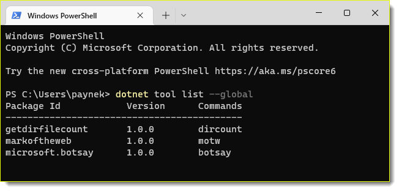

# Dotnet tools

dotnet tool list - Lists all .NET tools of the specified type currently installed on your machine. [](https://docs.microsoft.com/en-us/dotnet/core/tools/dotnet-tool-list)

```
dotnet tool list --global
```



## Global tools location

```
C:\\Users\WindowLoginName\\.dotnet\\tools
```

## dotnet tool install

`dotnet tool install` - Installs the specified .NET tool on your machine. [](https://docs.microsoft.com/en-us/dotnet/core/tools/dotnet-tool-install)

## dotnet tool uninstall

`dotnet tool uninstall` - Uninstalls the specified .NET tool from your machine.  [](https://docs.microsoft.com/en-us/dotnet/core/tools/dotnet-tool-uninstall)